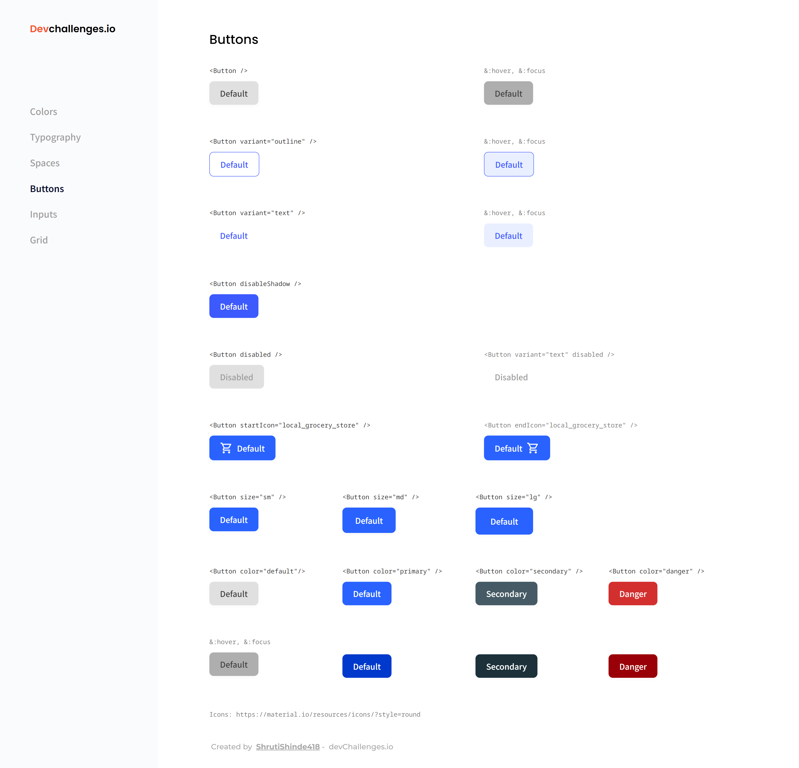

<!-- Please update value in the {}  -->

<h1 align="center">Button Component using React and SASS</h1>

<div align="center">
   Solution for a challenge from  <a href="http://devchallenges.io" target="_blank">Devchallenges.io</a>.
</div>

<div align="center">
  <h3>
    <a href="https://button-component-six.vercel.app/">
      Demo
    </a>
    <span> | </span>
    <a href="https://github.com/ShrutiShinde418/button-component">
      Solution
    </a>
    <span> | </span>
    <a href="https://devchallenges.io/challenges/ohgVTyJCbm5OZyTB2gNY">
      Challenge
    </a>
  </h3>
</div>

<!-- TABLE OF CONTENTS -->

## Table of Contents

- [Table of Contents](#table-of-contents)
- [Overview](#overview)
- [My process](#my-process)
  - [Built With](#built-with)
  - [What I learned](#what-i-learned)
  - [Continued development](#continued-development)
- [Features](#features)
- [How To Use](#how-to-use)
- [Acknowledgements](#acknowledgements)
- [Contact](#contact)

<!-- OVERVIEW -->

## Overview



## My process
### Built With

- [React](https://reactjs.org/)
- [SASS](https://sass-lang.com/)

### What I learned

- SASS with React
- Interpolation in SASS

### Continued development

- Interpolation and looping in SASS

## Features

This application/site was created as a submission to a [DevChallenges](https://devchallenges.io/challenges) challenge. The [challenge](https://devchallenges.io/challenges/ohgVTyJCbm5OZyTB2gNY) was to build an application to complete the given user stories.

## How To Use

<!-- This is an example, please update according to your application -->

To clone and run this application, you'll need [Git](https://git-scm.com) and [Node.js](https://nodejs.org/en/download/) (which comes with [npm](http://npmjs.com)) installed on your computer. From your command line:

```bash
# Clone this repository
$ git clone https://github.com/ShrutiShinde418/button-component

# Install dependencies
$ npm install

# Run the app
$ npm start
```
## Acknowledgements

- [This Stack Overflow Post](https://stackoverflow.com/questions/56536821/sass-variable-interpolation-in-each-loop) - This helped in modularizing my code.

## Contact

- GitHub [@ShrutiShinde418](https://github.com/ShrutiShinde418)
